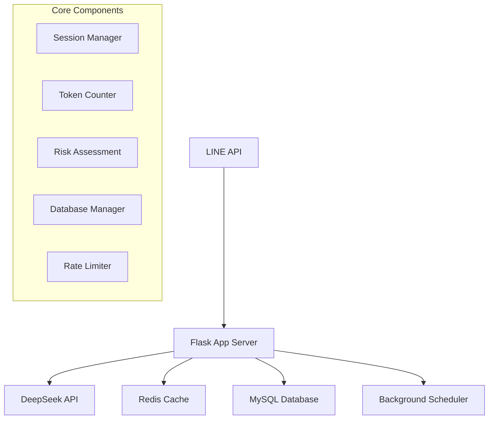
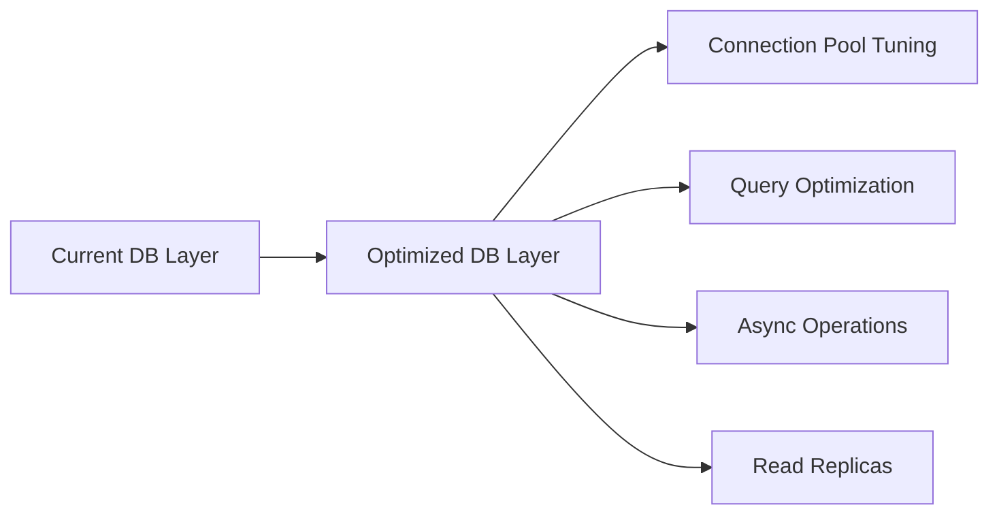
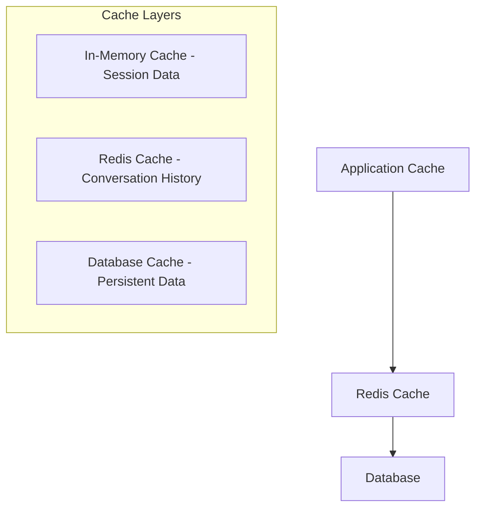
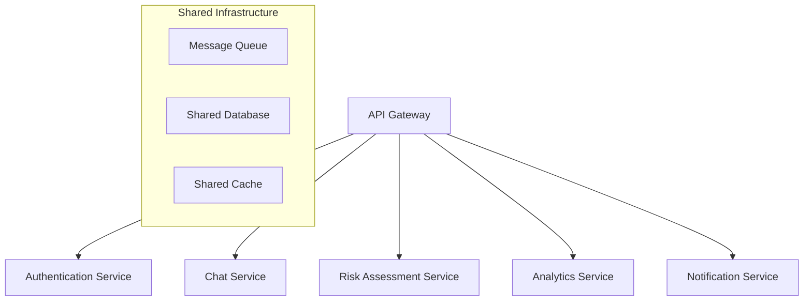
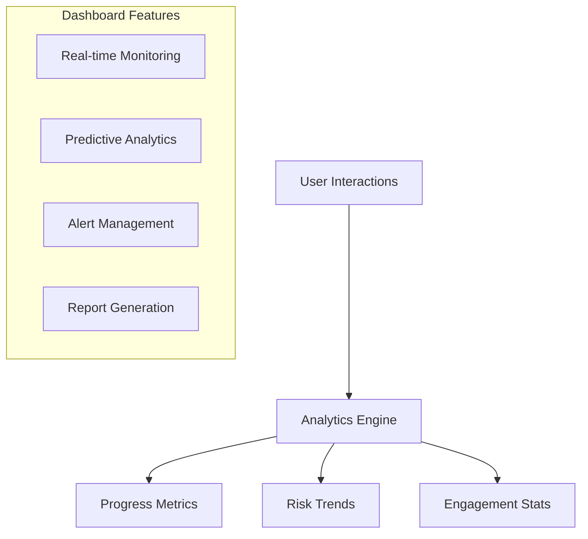
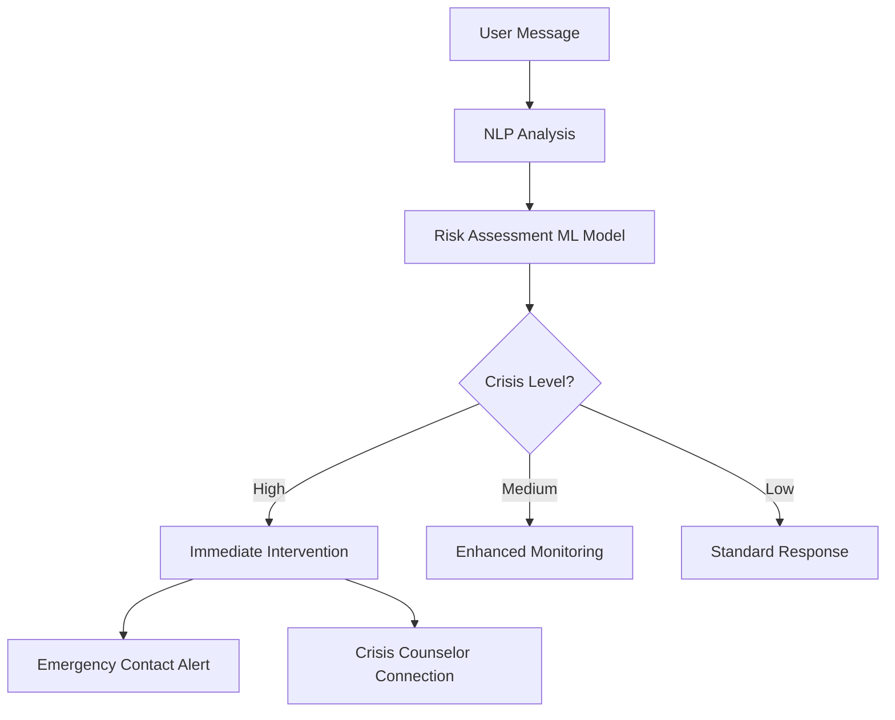

# TyphoonLineWebhook Codebase Analysis & Optimization Report

## Overview
This report analyzes the TyphoonLineWebhook system, a LINE-based chatbot for substance abuse support. The analysis identifies current weaknesses, performance bottlenecks, and provides actionable recommendations for improvements and new features.

## Architecture Assessment

### Current System Architecture


### Technology Stack Analysis
- **Backend Framework**: Flask (Good choice for small-medium scale)
- **Database**: MySQL with connection pooling (Adequate)
- **Cache**: Redis (Excellent choice)
- **External APIs**: LINE Messaging API, DeepSeek API
- **Async Processing**: Custom AsyncDeepseekClient
- **Scheduling**: APScheduler

## Critical Weaknesses & Issues

### 1. Database Performance Issues

#### Current Problems
- **Inefficient Connection Management**: Default pool size of 10 connections may be insufficient under load
- **No Query Optimization**: Missing database indexes for frequently accessed columns
- **Synchronous Database Operations**: All database operations are blocking
- **Limited Connection Pool Configuration**: No connection timeout or retry mechanisms

#### Performance Impact
- High latency during concurrent user sessions
- Database connection exhaustion under moderate load
- Blocking operations affecting overall response time

### 2. Memory Management Concerns

#### Token Counter Cache Issues
```python
# Current implementation has unbounded growth potential
class LRUCache:
    def __init__(self, capacity: int = 1000):  # Fixed size but no monitoring
```

#### Session Management Problems
- Redis session data grows without proper cleanup
- No memory pressure handling
- Conversation history can consume excessive memory

### 3. Error Handling Inconsistencies

#### Fragmented Error Management
- Multiple error handling patterns (decorators, try-catch, custom exceptions)
- Inconsistent error logging and user feedback
- No centralized error monitoring or alerting

#### Missing Circuit Breaker Pattern
- No protection against cascading failures
- External API failures can impact entire system
- No graceful degradation mechanisms

### 4. Security Vulnerabilities

#### Authentication Weaknesses
- Simple verification code system without rate limiting
- No brute force protection for registration codes
- Missing input validation and sanitization

#### Data Privacy Concerns
- User context stored indefinitely in Redis
- No data encryption at rest
- Limited access controls

### 5. Scalability Limitations

#### Single Instance Architecture
- No horizontal scaling capabilities
- All processing on single thread for most operations
- Scheduler runs on single instance only

#### Resource Bottlenecks
- Synchronous processing model
- No load balancing considerations
- Limited concurrent user handling

## Performance Optimization Recommendations

### 1. Database Layer Enhancements

#### Implement Database Optimizations


**Actionable Steps:**
- Increase connection pool size to 50-100 connections
- Add database indexes on frequently queried columns
- Implement connection health checks
- Add database query performance monitoring
- Consider read replicas for conversation history queries

#### Database Schema Improvements
```sql
-- Add missing indexes
CREATE INDEX idx_conversations_user_timestamp ON conversations(user_id, timestamp);
CREATE INDEX idx_conversations_risk_level ON conversations(risk_level);
CREATE INDEX idx_registration_created_at ON registration_codes(created_at);

-- Add partitioning for large tables
ALTER TABLE conversations PARTITION BY RANGE (YEAR(timestamp));
```

### 2. Caching Strategy Enhancement

#### Multi-Level Caching Architecture


**Implementation:**
- Add application-level caching for frequently accessed data
- Implement cache warming strategies
- Add cache invalidation policies
- Monitor cache hit rates and optimize accordingly

### 3. Asynchronous Processing Implementation

#### Background Task Processing
```python
# Recommended async implementation
import asyncio
from celery import Celery

class AsyncTaskManager:
    def __init__(self):
        self.celery = Celery('chatbot_tasks')
    
    @celery.task
    def process_ai_response_async(self, user_id, message):
        # Process AI response in background
        pass
    
    @celery.task
    def update_user_metrics_async(self, user_id, metrics):
        # Update metrics asynchronously
        pass
```

**Benefits:**
- Non-blocking user interactions
- Better resource utilization
- Improved response times
- Scalable background processing

## Architectural Improvements

### 1. Microservices Migration Strategy

#### Proposed Service Decomposition


### 2. Event-Driven Architecture

#### Message Queue Integration
```python
# Event-driven message processing
class EventManager:
    def __init__(self):
        self.event_bus = EventBus()
    
    def publish_user_message(self, user_id, message):
        event = UserMessageEvent(user_id, message)
        self.event_bus.publish(event)
    
    def subscribe_to_risk_alerts(self, handler):
        self.event_bus.subscribe(RiskAlertEvent, handler)
```

### 3. Circuit Breaker Implementation

#### External API Protection
```python
from circuit_breaker import CircuitBreaker

class ProtectedDeepSeekClient:
    def __init__(self):
        self.circuit_breaker = CircuitBreaker(
            failure_threshold=5,
            recovery_timeout=30,
            expected_exception=DeepSeekAPIError
        )
    
    @circuit_breaker
    def generate_response(self, messages):
        # Protected API call
        return self.deepseek_client.chat.completions.create(...)
```

## Security Enhancements

### 1. Authentication & Authorization

#### Multi-Factor Authentication
```python
class EnhancedAuthManager:
    def verify_user_registration(self, user_id, code, phone_verification=None):
        # Add phone/email verification
        # Implement time-based code expiration
        # Add rate limiting per user
        pass
```

### 2. Data Protection

#### Encryption Implementation
```python
from cryptography.fernet import Fernet

class SecureDataManager:
    def __init__(self):
        self.cipher_suite = Fernet(self.load_encryption_key())
    
    def encrypt_user_data(self, data):
        return self.cipher_suite.encrypt(data.encode())
    
    def decrypt_user_data(self, encrypted_data):
        return self.cipher_suite.decrypt(encrypted_data).decode()
```

### 3. Input Validation & Sanitization

#### Comprehensive Input Filtering
```python
from marshmallow import Schema, fields, validate

class UserMessageSchema(Schema):
    user_id = fields.Str(required=True, validate=validate.Length(max=50))
    message = fields.Str(required=True, validate=validate.Length(max=2000))
    timestamp = fields.DateTime()
```

## New Feature Recommendations

### 1. Advanced Analytics Dashboard

#### User Progress Tracking


**Implementation Features:**
- Real-time user engagement monitoring
- Predictive risk assessment using ML models
- Custom alert rules for administrators
- Automated report generation

### 2. Multi-Language Support

#### Internationalization Framework
```python
class MultiLanguageManager:
    def __init__(self):
        self.translations = self.load_translations()
    
    def get_response(self, message_key, user_language='th'):
        return self.translations[user_language][message_key]
    
    def detect_language(self, user_message):
        # Implement language detection
        pass
```

### 3. Voice Message Support

#### Audio Processing Integration
```python
class VoiceMessageHandler:
    def __init__(self):
        self.speech_to_text = SpeechToTextService()
        self.text_to_speech = TextToSpeechService()
    
    async def process_voice_message(self, audio_data):
        text = await self.speech_to_text.convert(audio_data)
        response = await self.generate_text_response(text)
        audio_response = await self.text_to_speech.convert(response)
        return audio_response
```

### 4. AI-Powered Crisis Intervention

#### Enhanced Risk Detection


### 5. Gamification Elements

#### User Engagement Features
- Daily check-in streaks
- Progress badges and achievements
- Milestone celebrations
- Social support group features
- Anonymous peer support connections

### 6. Integration with Healthcare Systems

#### EHR Integration Framework
```python
class HealthcareIntegration:
    def __init__(self):
        self.ehr_client = EHRClient()
        self.fhir_client = FHIRClient()
    
    def sync_user_progress(self, user_id, progress_data):
        # Sync with healthcare provider systems
        pass
    
    def get_treatment_recommendations(self, user_profile):
        # Get personalized treatment suggestions
        pass
```

## Implementation Roadmap

### Phase 1: Critical Performance Improvements (1-2 months)
1. Database optimization and indexing
2. Connection pool configuration
3. Error handling standardization
4. Basic security enhancements

### Phase 2: Scalability Enhancements (2-3 months)
1. Asynchronous processing implementation
2. Caching strategy deployment
3. Circuit breaker pattern implementation
4. Load testing and optimization

### Phase 3: Feature Development (3-4 months)
1. Analytics dashboard development
2. Advanced risk assessment ML models
3. Multi-language support
4. Voice message capabilities

### Phase 4: Advanced Features (4-6 months)
1. Microservices migration
2. Healthcare system integration
3. Advanced crisis intervention
4. Mobile application development

## Monitoring & Observability

### 1. Application Performance Monitoring

#### Metrics to Track
```python
class MetricsCollector:
    def __init__(self):
        self.prometheus_client = PrometheusClient()
    
    def track_response_time(self, endpoint, duration):
        self.prometheus_client.histogram(
            'response_time_seconds',
            duration,
            labels={'endpoint': endpoint}
        )
    
    def track_error_rate(self, error_type):
        self.prometheus_client.counter(
            'errors_total',
            labels={'type': error_type}
        )
```

### 2. Health Check Implementation

#### Comprehensive Health Monitoring
```python
class HealthCheckManager:
    def __init__(self):
        self.checks = [
            DatabaseHealthCheck(),
            RedisHealthCheck(),
            DeepSeekAPIHealthCheck(),
            DiskSpaceCheck(),
            MemoryUsageCheck()
        ]
    
    async def run_health_checks(self):
        results = {}
        for check in self.checks:
            results[check.name] = await check.execute()
        return results
```

## Cost Optimization Strategies

### 1. Resource Usage Optimization
- Implement request batching for DeepSeek API calls
- Optimize token counting to reduce API costs
- Add intelligent conversation summarization
- Implement user activity-based scaling

### 2. Infrastructure Cost Reduction
- Use managed database services for better cost/performance ratio
- Implement auto-scaling based on usage patterns
- Optimize Redis memory usage with data compression
- Use CDN for static assets and common responses

## Risk Mitigation

### 1. Business Continuity Planning
- Implement database backup and recovery procedures
- Add failover mechanisms for critical services
- Create disaster recovery playbooks
- Establish monitoring and alerting protocols

### 2. Compliance & Regulatory Considerations
- GDPR compliance for user data handling
- Healthcare data protection standards
- Audit logging for all user interactions
- Data retention and deletion policies

## Conclusion

The TyphoonLineWebhook system shows strong foundational architecture but requires significant improvements in performance, scalability, and security. The recommended improvements will enhance system reliability, user experience, and operational efficiency while enabling advanced features for better substance abuse support.

The implementation should follow a phased approach, prioritizing critical performance issues before adding new features. Regular monitoring and iterative improvements will ensure the system scales effectively with user growth while maintaining high service quality.