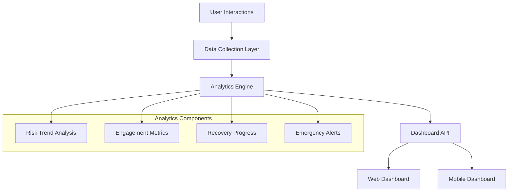
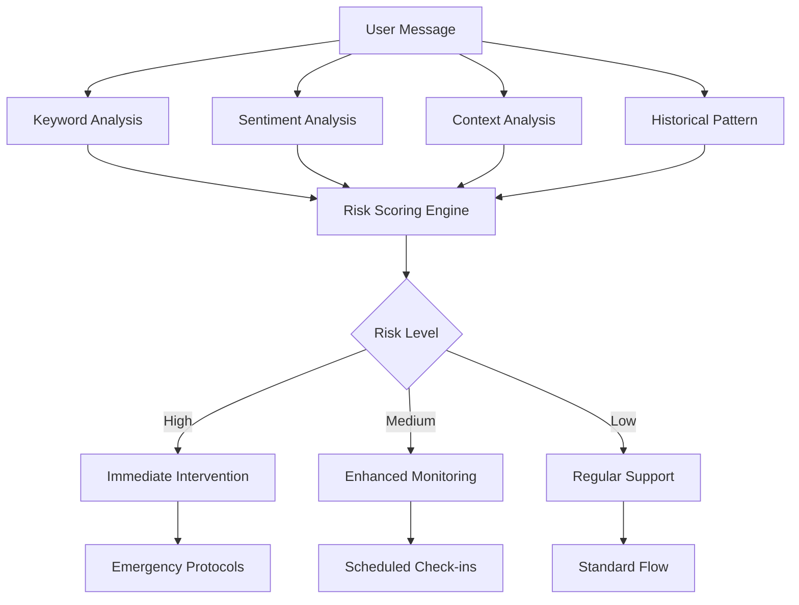
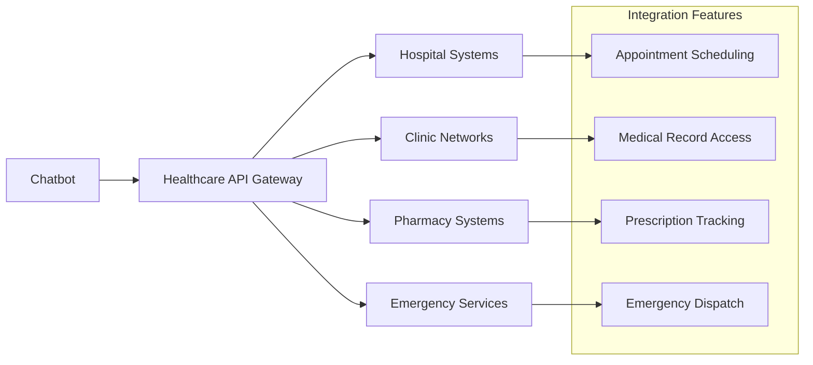
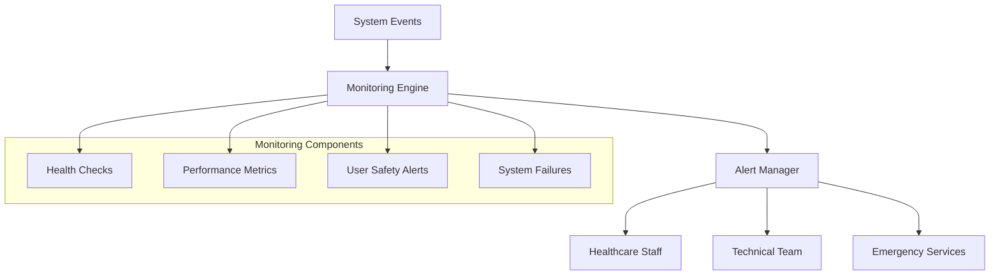
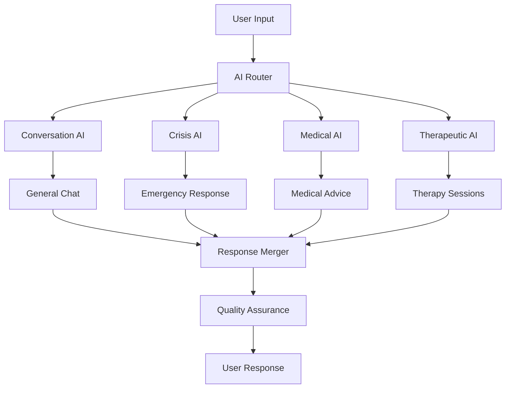
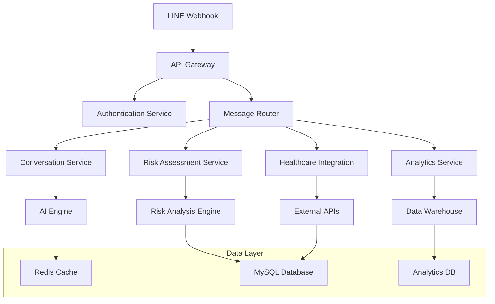
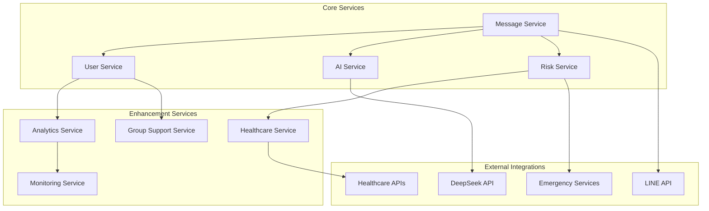

# TyphoonLineWebhook Enhancement Design

## Overview

The TyphoonLineWebhook is a LINE-based chatbot for substance abuse support in Thai language. Based on comprehensive analysis of the existing codebase, this document outlines key improvement opportunities and new features to enhance user experience, system reliability, and therapeutic effectiveness.

## Current System Analysis

### Existing Features
- Conversational support with DeepSeek AI integration
- Risk assessment and emergency intervention
- Scheduled follow-up system (1, 3, 7, 14, 30-day intervals)
- Session management with Redis caching
- User registration with verification codes
- Basic metrics and logging
- Hospital information lookup
- Command-based interaction system

### Technology Stack
- **Backend**: Python Flask, Redis, MySQL
- **AI Integration**: DeepSeek API via OpenAI client
- **Messaging**: LINE Messaging API
- **Scheduling**: APScheduler
- **Database**: MySQL with connection pooling

## Enhancement Opportunities

### 1. Advanced Analytics & Reporting Dashboard

#### Current State
- Basic metrics collection exists but limited visualization
- No comprehensive analytics dashboard
- Limited progress tracking capabilities

#### Proposed Enhancement
Create a web-based analytics dashboard for healthcare professionals and administrators.



**Features:**
- Real-time user engagement analytics
- Risk level trend visualization
- Recovery milestone tracking
- Emergency intervention effectiveness
- Geographic usage patterns
- AI response quality metrics

### 2. Enhanced Risk Assessment System

#### Current State
- Basic keyword-based risk detection
- Simple high/medium/low classification
- Limited contextual understanding

#### Proposed Enhancement
Multi-layered risk assessment with machine learning integration.



**Features:**
- Sentiment analysis integration
- Pattern recognition for relapse indicators
- Contextual risk evaluation
- Dynamic threshold adjustment
- Predictive risk modeling

### 3. Personalized Treatment Pathways

#### Current State
- Generic responses for all users
- Basic personalization based on registration data
- No structured treatment progression

#### Proposed Enhancement
AI-driven personalized treatment recommendations and pathways.

**Features:**
- Individual treatment plan generation
- Progress-based content adaptation
- Customized coping strategy recommendations
- Personalized recovery milestone tracking
- Adaptive intervention timing

### 4. Integration with Healthcare Systems

#### Current State
- Static hospital information lookup
- No integration with healthcare providers
- Manual reference to emergency services

#### Proposed Enhancement
Seamless integration with healthcare systems and providers.



**Features:**
- Real-time appointment booking
- Medical record integration (with consent)
- Medication reminder system
- Direct emergency service coordination
- Healthcare provider notifications

### 5. Group Support & Community Features

#### Current State
- Individual-only interactions
- No peer support mechanisms
- Isolated user experience

#### Proposed Enhancement
Moderated group support and community features.

**Features:**
- Anonymous group chat rooms
- Peer mentorship matching
- Success story sharing
- Group challenges and activities
- Moderated support groups
- Crisis buddy system

### 6. Advanced Monitoring & Alerting

#### Current State
- Basic error logging
- Simple metrics collection
- Manual monitoring required

#### Proposed Enhancement
Comprehensive monitoring and alerting system.



**Features:**
- Real-time system health monitoring
- Automated emergency escalation
- Performance optimization alerts
- User safety monitoring
- Compliance tracking
- Predictive maintenance

### 7. Mobile Application Companion

#### Current State
- LINE-only interface
- Limited platform availability
- Basic messaging interaction

#### Proposed Enhancement
Dedicated mobile application with enhanced features.

**Features:**
- Offline support capabilities
- Voice message support
- Video consultation integration
- Medication tracking
- Progress visualization
- Emergency one-touch access
- Biometric data integration

### 8. Advanced AI Capabilities

#### Current State
- Single AI model (DeepSeek)
- Basic conversation handling
- Limited specialization

#### Proposed Enhancement
Multi-model AI system with specialized capabilities.



**Features:**
- Specialized AI models for different scenarios
- Multi-language support expansion
- Voice AI integration
- Emotion recognition
- Therapy technique implementation
- Medical knowledge integration

## Implementation Architecture

### Database Schema Enhancements

```sql
-- Enhanced user profiles
CREATE TABLE user_profiles (
    id INT PRIMARY KEY AUTO_INCREMENT,
    user_id VARCHAR(50) NOT NULL,
    treatment_stage ENUM('assessment', 'detox', 'recovery', 'maintenance'),
    risk_score FLOAT DEFAULT 0,
    last_risk_update DATETIME,
    preferences JSON,
    created_at DATETIME DEFAULT CURRENT_TIMESTAMP,
    updated_at DATETIME DEFAULT CURRENT_TIMESTAMP ON UPDATE CURRENT_TIMESTAMP
);

-- Treatment pathways
CREATE TABLE treatment_pathways (
    id INT PRIMARY KEY AUTO_INCREMENT,
    user_id VARCHAR(50) NOT NULL,
    pathway_type VARCHAR(100),
    current_step INT DEFAULT 1,
    progress_percentage FLOAT DEFAULT 0,
    milestones_achieved JSON,
    next_milestone_date DATETIME,
    created_at DATETIME DEFAULT CURRENT_TIMESTAMP
);

-- Enhanced risk assessments
CREATE TABLE risk_assessments (
    id INT PRIMARY KEY AUTO_INCREMENT,
    user_id VARCHAR(50) NOT NULL,
    assessment_type ENUM('automated', 'manual', 'emergency'),
    risk_level ENUM('low', 'medium', 'high', 'critical'),
    risk_score FLOAT,
    factors JSON,
    recommended_actions JSON,
    assessment_timestamp DATETIME DEFAULT CURRENT_TIMESTAMP
);

-- Group support features
CREATE TABLE support_groups (
    id INT PRIMARY KEY AUTO_INCREMENT,
    group_name VARCHAR(200),
    group_type ENUM('general', 'specialized', 'crisis'),
    moderator_id VARCHAR(50),
    max_participants INT DEFAULT 20,
    created_at DATETIME DEFAULT CURRENT_TIMESTAMP
);

-- Integration endpoints
CREATE TABLE healthcare_integrations (
    id INT PRIMARY KEY AUTO_INCREMENT,
    user_id VARCHAR(50) NOT NULL,
    provider_type ENUM('hospital', 'clinic', 'pharmacy', 'emergency'),
    provider_id VARCHAR(100),
    integration_data JSON,
    last_sync DATETIME,
    status ENUM('active', 'inactive', 'pending')
);
```

### API Architecture



### Microservices Architecture



## Testing Strategy

### Unit Testing
- Service layer testing with mocking
- Database operation testing
- AI integration testing
- Risk assessment logic testing

### Integration Testing
- API endpoint testing
- Healthcare system integration testing
- Emergency service integration testing
- Multi-service workflow testing

### Performance Testing
- Load testing for concurrent users
- Database performance optimization
- AI response time testing
- System resource monitoring

### Security Testing
- Data privacy compliance testing
- Authentication and authorization testing
- API security testing
- Healthcare data protection testing

## Monitoring and Observability

### Key Performance Indicators (KPIs)
- User engagement rates
- Risk detection accuracy
- Emergency response times
- Treatment pathway completion rates
- System availability and performance
- Healthcare integration success rates

### Alerting System
- Critical risk level alerts
- System failure notifications
- Performance degradation warnings
- Healthcare provider notifications
- Emergency service coordination alerts

### Logging and Tracing
- Structured logging with correlation IDs
- Distributed tracing for microservices
- User interaction tracking
- AI model performance logging
- Healthcare integration audit trails

## Security and Compliance

### Data Protection
- End-to-end encryption for sensitive data
- GDPR/PDPA compliance
- Healthcare data protection standards
- Secure API communications
- Regular security audits

### Access Control
- Role-based access control (RBAC)
- Multi-factor authentication
- API rate limiting and throttling
- Healthcare provider access management
- Emergency service authorization

### Audit and Compliance
- Comprehensive audit logging
- Compliance reporting dashboards
- Healthcare regulation adherence
- Data retention policy enforcement
- Regular compliance assessments